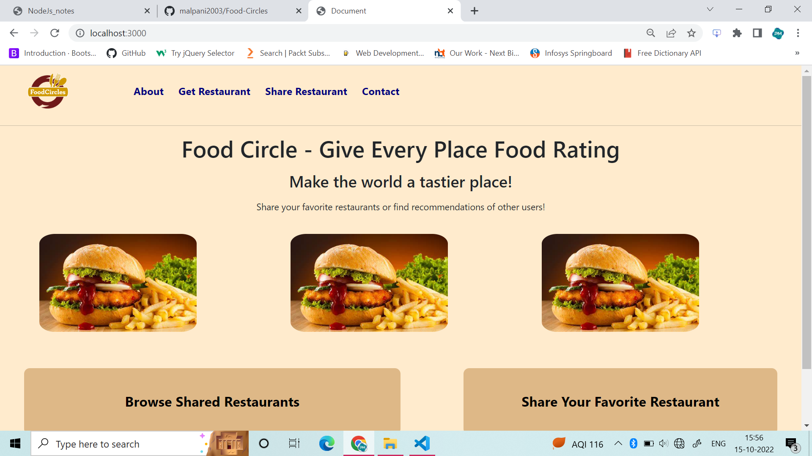
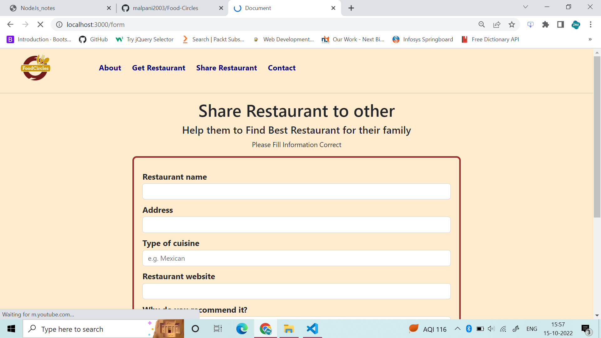
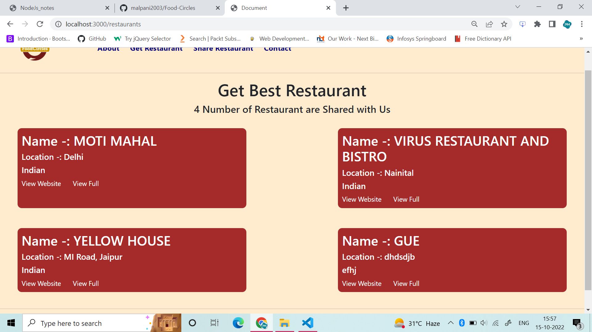
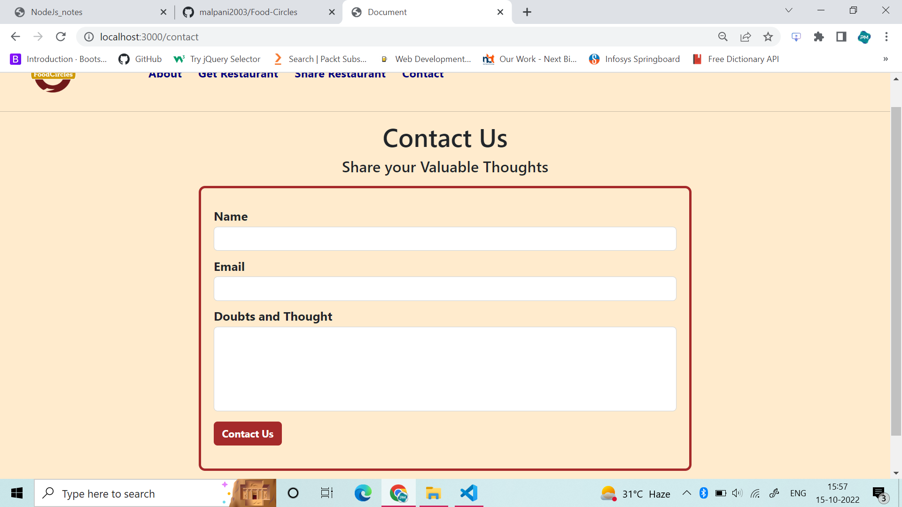
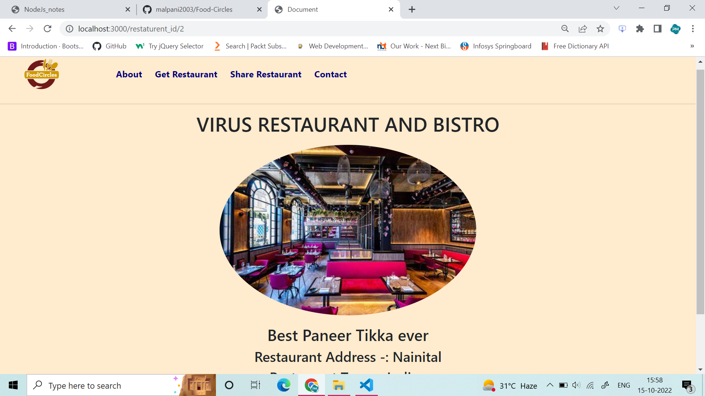

# Food-Circles

 <ol>
        <li>npm init</li>
        <li>npm install express</li>
        <li>npm install ejs</li>
        <li>node app.js</li>
        <li>Go to localhost:3000 in Browser</li>
    </ol>

